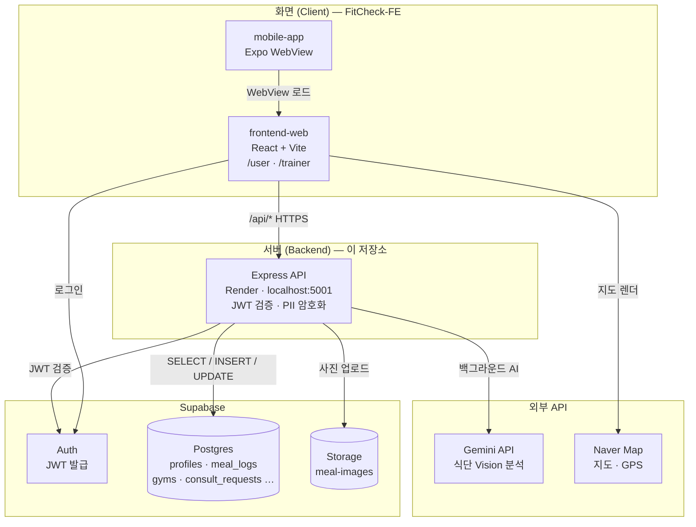
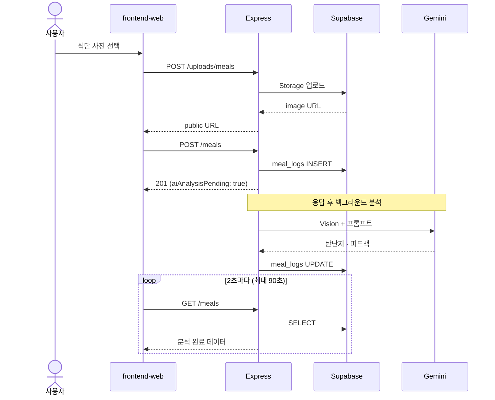
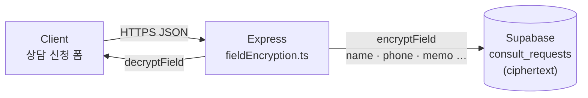
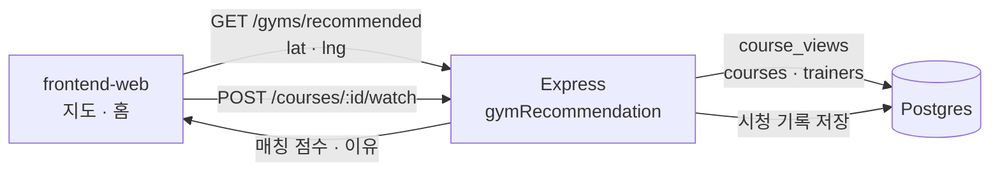

# FitCheck Backend

피트니스 입문자와 골목 헬스장(소상공인)을 잇는 스마트 피트니스 플랫폼의 **API 서버**입니다.

> **2026-09-07** — Naver AI Agent Challenge에서 시작된 개인 프로젝트를 GitHub Organization으로 분리 및 푸시하였습니다.

프론트엔드(웹·모바일)는 별도 저장소입니다. → **[FitCheck-FE](https://github.com/FitCheck-Healthcare/FitCheck-FE)**

## 현재 진행도 (2026-07-30)

회원 경로(MVP)는 **백엔드 ↔ 프론트 연동 완료**, **Vercel·Render 프로덕션 배포**까지 동작합니다.  
트레이너 모드는 **로컬 Mock** 단계입니다.

| 영역 | 상태 | 요약 |
|------|------|------|
| **Backend API** | ✅ MVP | 강좌·헬스장·상담(PII)·식단(AI)·매칭 점수 — [docs/README.md](./docs/README.md) |
| **Frontend 회원 `/user`** | ✅ | Google + 이메일 이중 로그인, 홈·강좌·지도·상담·식단 API 연동 — [FitCheck-FE](https://github.com/FitCheck-Healthcare/FitCheck-FE) |
| **Frontend 트레이너 `/trainer`** | 🟡 Mock | localStorage 기반, 백엔드 미연동 |
| **Mobile App** | ✅ WebView | Safe Area 연동 + frontend-web 래퍼 — [FitCheck-FE/mobile-app](https://github.com/FitCheck-Healthcare/FitCheck-FE/tree/main/mobile-app) |

**범례:** ✅ 동작 · 🟡 부분/Mock · ❌ 미구현

### 배포

| 서비스 | 플랫폼 | URL |
|--------|--------|-----|
| **웹 (frontend-web)** | Vercel | https://hub-tan-pi.vercel.app |
| **API (backend)** | Render | https://fitcheck-server-wvj4.onrender.com |

---

## 프로젝트 구조

```
FitCheck-BE/
├── src/
│   ├── app.ts              # Express 엔트리
│   ├── controllers/        # 요청 처리
│   ├── routes/             # /api/v1/* 라우트
│   ├── services/           # 도메인 로직 · Gemini · Naver Search
│   ├── middleware/         # JWT 검증
│   ├── lib/                # Supabase 클라이언트
│   ├── types/
│   └── utils/              # PII 암호화 (fieldEncryption.ts)
├── supabase/migrations/    # Postgres 스키마 · seed
├── scripts/                # db:migrate, seed-gyms
├── docs/
│   ├── README.md           # API 진행도
│   └── API.md              # REST API v1 명세
└── .env.example
```

| 폴더 | 역할 | 문서 |
|------|------|------|
| [`src/`](./src/) | Express API, PII 암호화, 매칭 점수 | 이 파일 · [docs/API.md](./docs/API.md) |
| [`docs/`](./docs/) | API 진행도 · 명세 | [docs/README.md](./docs/README.md) |
| [`supabase/migrations/`](./supabase/migrations/) | 스키마 · seed · PII | — |

관련 저장소: [FitCheck-FE](https://github.com/FitCheck-Healthcare/FitCheck-FE) (`frontend-web`, `mobile-app`)

## 아키텍처 & 데이터 흐름

화면(React), Express API, Supabase DB·Storage, 외부 API(Gemini·Naver Map)의 연결 구조입니다.

### 전체 구조



| 구간 | 설명 |
|------|------|
| Client → Express | Vite dev는 `/api`를 `localhost:5001`로 프록시 |
| Express → Postgres | 강좌·헬스장·식단·상담 등 CRUD |
| Express → Gemini | 식단 사진 분석 (저장 후 백그라운드) |
| Express → Storage | 식단 사진 업로드 → public URL → `meal_logs.image_url` |

### 식단 AI (비동기 저장)

사용자는 **1~2초 안에 저장 완료**를 체감하고, AI 결과는 타임라인에서 **2초 폴링**으로 갱신됩니다.



### 상담 PII (AES-256-GCM)

상담 신청의 이름·연락처·메모만 **앱 레벨 필드 암호화**합니다. 식단·프로필 등은 JWT 인증 + DB 접근 통제로 보호합니다.



→ 상세: [상담 신청 개인정보 암호화](#상담-신청-개인정보-암호화)

### 헬스장 매칭

PT 강좌 시청 기록(`course_views`)과 GPS 위치를 Express에서 **규칙 기반 점수**로 계산합니다. (Gemini 미사용)



## 빠른 시작

```bash
npm install
cp .env.example .env   # Supabase, 암호화 키 등 설정
npm run db:migrate     # 최초 1회
npm run dev
```

→ http://localhost:5001

프론트엔드 로컬 실행은 [FitCheck-FE](https://github.com/FitCheck-Healthcare/FitCheck-FE)의 `frontend-web`을 따릅니다.  
Vite dev 서버는 `/api`를 `localhost:5001`로 프록시합니다.

### 프로덕션 (배포)

| 서비스 | 플랫폼 | 비고 |
|--------|--------|------|
| frontend-web | **Vercel** | [FitCheck-FE](https://github.com/FitCheck-Healthcare/FitCheck-FE) |
| backend | **Render** | https://fitcheck-server-wvj4.onrender.com |

프론트 환경 변수: `VITE_API_BASE_URL=https://fitcheck-server-wvj4.onrender.com`, `VITE_SUPABASE_*`, `VITE_SITE_URL`, `VITE_NAVER_MAP_CLIENT_ID`

Supabase Redirect URLs: `/auth/callback`, `/reset-password` (로컬·배포 도메인 모두 등록)

## 요구 사항

- Node.js 18+
- Supabase 프로젝트 (`.env`)
- 프론트엔드: [FitCheck-FE](https://github.com/FitCheck-Healthcare/FitCheck-FE)

## 환경 변수

`.env.example` → `.env`

| 변수 | 설명 |
|------|------|
| `PORT` | 기본 `5001` (macOS AirPlay가 5000을 사용) |
| `SUPABASE_URL` | Supabase 프로젝트 URL |
| `SUPABASE_SERVICE_ROLE_KEY` | service_role 키 (서버 전용) |
| `SUPABASE_DB_PASSWORD` | 마이그레이션용 DB 비밀번호 |
| `NAVER_SEARCH_CLIENT_ID` / `SECRET` | 지역 검색 API (서버 전용) |
| `ENCRYPTION_KEY` | 상담 PII AES-256-GCM 키 (`openssl rand -base64 32`) |
| `PHONE_HMAC_PEPPER` | 전화번호 조회용 HMAC pepper |
| `GEMINI_API_KEY` | 식단 Vision 분석 |

## 상담 신청 개인정보 암호화

상담 신청의 이름·연락처·주제·메모만 백엔드에서 **AES-256-GCM**으로 암호화해 Supabase에 저장합니다.

| 항목 | 내용 |
|------|------|
| 알고리즘 | AES-256-GCM |
| 암호문 형식 | `v1:<iv>:<tag>:<ciphertext>` (base64url) |
| 대상 필드 | `name`, `phone`, `topic`, `topic_detail`, `memo` |
| 전화번호 조회 | HMAC-SHA256 (`phone_hmac`) — 평문 검색 없이 매칭 |
| 구현 | [`src/utils/fieldEncryption.ts`](./src/utils/fieldEncryption.ts) |

키는 `.env`의 `ENCRYPTION_KEY`(32바이트 base64), `PHONE_HMAC_PEPPER`로 관리합니다.
